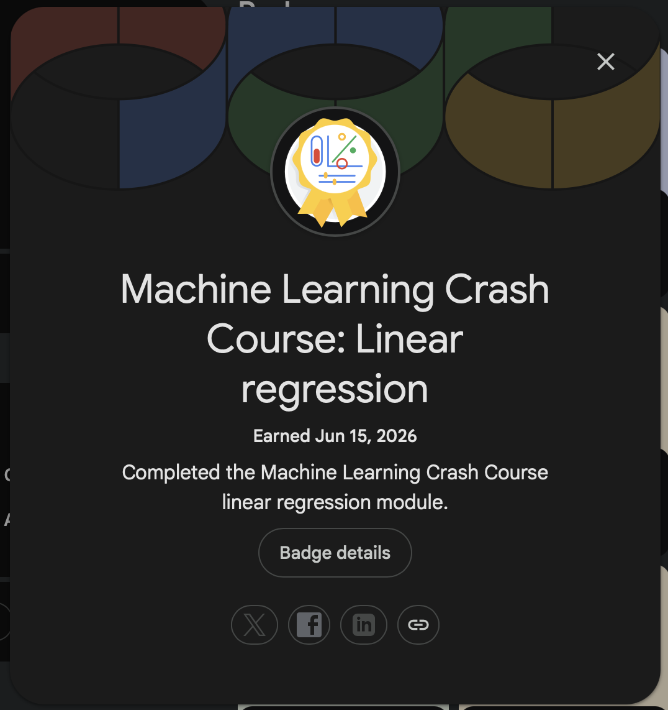

# 🤖 Google Machine Learning Crash Course (MLCC)

> A collection of notes, assignments, labs, quizzes, and hands-on exercises completed while studying Google's Machine Learning Crash Course (MLCC).


---

## 📖 About

This repository documents my learning journey through the **Google Machine Learning Crash Course (MLCC)**. It contains practical implementations, exercises, notes, and assignments completed using **Google Colab** and **Python**.

The goal of this repository is to strengthen my understanding of machine learning fundamentals and maintain a structured record of my progress.

---

## 🎯 Learning Objectives

- Understand the fundamentals of Machine Learning.
- Build and evaluate regression and classification models.
- Learn data preprocessing and feature engineering techniques.
- Explore neural networks and embeddings.
- Understand Large Language Models (LLMs).
- Learn production ML systems and deployment concepts.
- Apply responsible AI and fairness principles.

---

# 📚 Course Modules

## 🔹 ML Models

- Linear Regression
- Logistic Regression
- Classification

## 🔹 Data

- Working with Numerical Data
- Working with Categorical Data
- Datasets, Generalization, and Overfitting

## 🔹 Advanced ML Models

- Neural Networks
- Embeddings
- Introduction to Large Language Models (LLMs)

## 🔹 Real-World ML

- Production ML Systems
- AutoML
- ML Fairness

---

## 📂 Repository Structure

```text
Google-ML-Crash-Course/
│
├── 01-Linear-Regression/
├── 02-Logistic-Regression/
├── 03-Classification/
│
├── 04-Working-with-Numerical-Data/
├── 05-Working-with-Categorical-Data/
├── 06-Datasets-Generalization-and-Overfitting/
│
├── 07-Neural-Networks/
├── 08-Embeddings/
├── 09-Intro-to-Large-Language-Models/
│
├── 10-Production-ML-Systems/
├── 11-AutoML/
├── 12-ML-Fairness/
│
├── Notes/
├── Resources/
└── README.md
```

---

## 🛠️ Technologies Used

- Python
- Google Colab
- NumPy
- Pandas
- Matplotlib
- TensorFlow
- Git
- GitHub

---

## 📈 Progress Tracker

### ML Models

- [x] Linear Regression
- [x] Logistic Regression
- [x] Classification

### Data

- [ ] Working with Numerical Data
- [ ] Working with Categorical Data
- [ ] Datasets, Generalization, and Overfitting

### Advanced ML Models

- [ ] Neural Networks
- [ ] Embeddings
- [ ] Introduction to Large Language Models

### Real-World ML

- [ ] Production ML Systems
- [ ] AutoML
- [ ] ML Fairness

---

## 🚀 Getting Started

1. Clone the repository:

```bash
git clone https://github.com/your-username/google-ml-crash-course.git
```

2. Open the notebooks in Google Colab.

3. Follow the modules sequentially or jump directly to a topic of interest.

---

## 🏅 Earned Badges

### Linear Regression


---

## 🙏 Acknowledgements

This repository follows the curriculum provided by Google's Machine Learning Crash Course (MLCC).

Special thanks to Google Developers for making high-quality machine learning education freely available.

---

⭐ If you find this repository useful, feel free to star it!Technologies Used

* Python
* Google Colab
* NumPy
* Pandas
* Matplotlib
* TensorFlow
* Git & GitHub

Learning Objectives

* Build and evaluate machine learning models.
* Understand regression and classification techniques.
* Learn feature engineering and data preprocessing.
* Explore neural networks and embeddings.
* Understand the foundations of Large Language Models.
* Learn production deployment concepts and ML system design.
* Apply fairness and responsible AI principles.

Progress Tracker

* Linear Regression
* Logistic Regression
* Classification
* Working with Numerical Data
* Working with Categorical Data
* Datasets, Generalization, and Overfitting
* Neural Networks
* Embeddings
* Introduction to Large Language Models
* Production ML Systems
* AutoML
* ML Fairness

Author

Ansh Goyal

Computer Science Student | Machine Learning Enthusiast

Acknowledgements

This repository follows the curriculum provided by Google Developers through the Machine Learning Crash Course (MLCC). All rights to the course content belong to Google.

License

This repository is intended for educational and learning purposes only.
